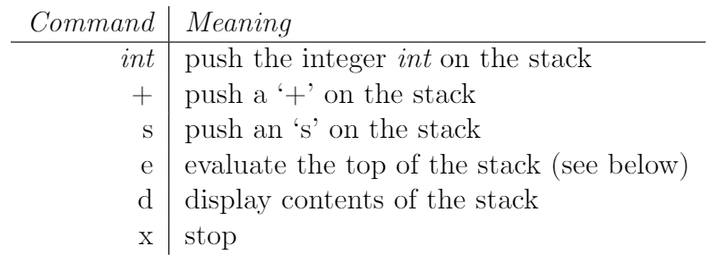

# 第一次作业：熟悉COOL语言 答案
## 作业要求
作业大意是通过`COOL`语言实现一个可以实现“整数加”计算的`stack`，且可以通过向输入区填入以下指令进行基本操作：



其中前三个指令是可以**进栈保留**的指令，后三个指令是对栈整体的操作。

- 进栈保留的指令
  |指令|含义|
  |:-:|-|
  |int|向栈中推入一个整数|
  |+|向栈中推入一个‘＋’号|
  |s|向栈中推入一个‘s’号|

- 对栈整体的操作
  |指令|含义|
  |:-:|-|
  |e|对栈顶元素进行“计算”|
  |d|显示栈内所有的内容|
  |x|程序结束|
  
其中`e`操作对于栈顶不同的元素有不同的效果：
- `int`:不产生任何改变
- `+`:将`+`号及其后两个元素（默认正确情况均为`int`元素）弹出，并将两`int`元素的值相加后得到的`int`值推入栈
- `s`:将`s`本身弹出，其后两个元素交换位置。
## 作业浅析
+ 这次作业主要是熟悉cool语言的写法，完成一个简单的“计算栈”的功能。
+ 设计者主要意图让学生了解`COOL`语言的继承功能，并且通过阅读文档熟悉语法。
+ 难点在于如何从纯英文的文档中快速找到所需的关键字、功能，并理解写法。
+ 完成时需要构建`Stack`类作为基本的数据结构，以及`StackCommand`类成员作为操作的载体（实际使用时需要派生新的类对应3种操作符）。
## 示例题解
按照题目推荐的解法，我首先构建了`StackCommand`类并派生了3种对应的类。

需要注意的是，这里在`excute`函数中使用了下文中提到的栈节点作为参数，此处先大致理解即可。

```java
(*
 *  CS164 Fall 94
 *
 *  Programming Assignment 1
 *    Implementation of a simple stack machine.
 *
 *  Skeleton file
 *)

class StackCommand {
   getChar() : String{
      "Get char function called from base class"
   };
   getInt() : Int {
      0
   };
   execute(node : StackNode) : StackNode{
      node
   };
   setInt(num : Int) : Int{
      0
   };
   display() : String{
      getChar()
   };
};

class IntCommand inherits StackCommand{
   value : Int;
   trans : A2I <- new A2I;
   getChar() : String{
      trans.i2a(value)   
   };
   getInt() : Int{
      value
   };
   --// execute Function is same as base
   --// display Function is same as base 
   setInt(num : Int) : Int{
      value <- num
   };
};

class PlusCommand inherits StackCommand{
   getChar() : String{
      "+"
   };
   --// getInt() is as same as base
   execute(node : StackNode) : StackNode{{
      if not (isvoid node.getNext()) then {
         if not (isvoid node.getNext().getNext()) then{
            let n1 : StackNode <- node.getNext(),
               n2 : StackNode <- n1.getNext() in {
                  {
                  n2.getCommand().setInt(n1.getCommand().getInt() + n2.getCommand().getInt());
                  n2;
                  };
            };
         }
         else
            0
         fi;
      }
      else
         0
      fi;
      node.getNext().getNext();
   }
   };
   --// display Function is same as base 
};

class SwapCommand inherits StackCommand{
   getChar() : String {
      "s"
   };
   execute(node : StackNode) : StackNode{
      let tmp : StackNode <- node.getNext().getNext() in {{
         node.getNext().setNext(tmp.getNext());
         tmp.setNext(node.getNext()); 
         tmp;
      };
      }
   };
   --// display Function is same as base 
};
```

接下来就需要先构建`StackNode`类作为栈的组件，并由它构成`Stack`类。`Stack`类它本身只保存了当前的头结点`head`，通过指针不断向后来访问全部内容。

```java
class StackNode{
   command : StackCommand;
   next : StackNode;
   init(co : StackCommand, ne : StackNode) : StackNode{
      {
      command <- co;
      next <- ne;
      }
   };
   getCommand() : StackCommand{
      command
   };
   getNext() : StackNode {
      next
   };
   setNext(node : StackNode): StackNode{
      next <- node
   };
};
--// Class of the Stack
class Stack inherits IO{
   nil : StackNode; --// Void pointer
   head : StackNode;
   trans : A2I <- new A2I;
   push(str : String) : StackNode{{
      let tmp : StackNode <- head in {
            head <- new StackNode; --//operator +
            if str = "+" then
               head.init(new PlusCommand, tmp)
            else
               if str = "s" then --//operator S
                  head.init(new SwapCommand, tmp)
               else              --// int number
               {
                  head.init(new IntCommand, tmp);
                  head.getCommand().setInt(trans.a2i(str));
               }
               fi
            fi;
      };           
      head;
   }
   };

   pop() : StackNode{
      if not(isvoid head) then
         head <- head.getCommand().execute(head)
      else
         head
      fi
   };

   show() : Object{
      if not(isvoid head) then
         let ptr : StackNode <- head in
            while not (isvoid ptr) loop{{
               out_string(ptr.getCommand().display());
               out_string(" ");
               ptr <- ptr.getNext();
               };
            }
            pool
      else
         0
      fi
   };

};
```
最后，我们还需要构建主要的输入输出控制，这里通过嵌套分支语句实现即可。
```java
class Main inherits IO {
   newline() : Object {
	   out_string("\n")
   };

   prompt() : String {
      {
         out_string(">");
         in_string();
      }
   };

   x : String ; --// buff for input string 
   testCommand : StackCommand <- new StackCommand;
   main() : Object {
      --// --// out_string("Nothing implemented\n"
      let stack : Stack <- new Stack in{
         x <- prompt();
         while not x = "x" loop{
            if x = "e" then
               stack.pop()
            else
               if x = "d" then{
                  stack.show();
                  newline();
               }
               else
                  stack.push(x)
               fi
            fi;
            x <- prompt();
         }
         pool;
      }
   };
};

```

## 总结
最重要的问题在于`COOL`语言起到C语言`return`作用的是代码块的求值，如果只有一行则无所谓，如果有多行代码，则需要在大括号内再套大括号，并通过`;`分割各个语句，这会使得代码的语法结构经常会有问题，需要特别注意。
