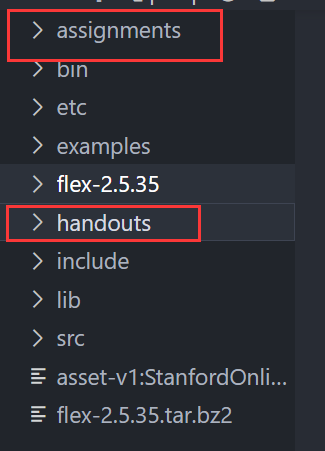

# 第二次作业：写一个COOL语言词法分析器
这一次作业的内容跨度比较大，并且涉及到的新技术和文件较多，所以先梳理一下学习流程。

本文件夹下有一个完整的`cool.flex`文件，即我实现的代码工作。

## 词法分析
Lexical Analysis, 即词法分析，也是本作业的重点。要求是将用户输入的字符串分解为一个又一个的`token`，以便接下来进一步分析使用。
## 浅析
词法分析器主要通过正则匹配合适的字符实现对于各个“词法单元”的匹配。比如`标识符`、`整型变量`、`字符串变量`、`关键字`、`运算符`等等。以便下一步语法分析（句法分析）时利用这些分割好的词法单元进一步处理。

实现上，本课程并没有要求从头实现正则匹配的功能，而是利用了`flex`这个程序来帮助我们正则匹配。实际上我们主要需要做的就是理解好COOL的语法特性，并掌握了`flex`的简要使用方法后，按照规则撰写对应的正则表达式即可。

知道了这个目标，我们需要做的就是阅读足量的英文文档来掌握所需的相关信息，这个过程可能会比较痛苦，但是锻炼快速提取英文信息的能力是值得的，尽量还是不要用整段的翻译软件。
## 需要阅读的文档
- 在课程提供的压缩包内所有文件中
  
   
  
  请先阅读如下资料：
  - `handouts/PA2.pdf`中包含了课程的基本要求，并简要的先介绍了一下`flex`大致使用方法。
  - `assignmen/PA2/README.md`包含了课程的基本目录结构，文件含义。
- 然后去阅读`flex`的使用方法
  - [`flex`官方文档](http://westes.github.io/flex/manual/)为了可以正确的撰写`.flex`文件，需要稍微深究一下`flex`的基本功能和语法，强烈建议学习前10章后再重新琢磨一下前两个文件。
  > 请注意，flex的文档网站需要用`IE`兼容模式打开，否则可能会渲染混乱。
- 可能需要的内容：
  - `handouts/cool-tour.pdf`的前4章，可以更好的理解不同组件之间的协作
  - 为了精准的撰写COOL语法所需的解析方式，想必`handouts/cool-manual.pdf`的COOL文档也是要时常翻看的。

## 注意事项
### cool.flex文件
在`assignments/PA2/`路径下的`cool.flex`文件中是我们在本作业中进行**全部代码**书写的地方，主要是书写正则表达式的规则以完成匹配。完成代码想要测试的时候可以根据`README`中的指引使用如下指令测试自己的lexer是否正确：
```
make dotest
```
这个指令会帮你按要求解析此路径下的`test.cl`文件。如果你之前配置的环境没有问题的话，那么此时你可以使用下面这个指令，来查看课程提供的正确的`lexer`的目标输出是什么。
```
lexer test.cl
```

举个例子，如果我们撰写了如下的代码在`test.cl`中。
```java
class Main inherits IO{
    main() : Object{
        out_string("Hello world!\n")
    };
};
```

我们用官方的`lexer`指令执行后输出了如下内容：
```
#name "test.cl"
#1 CLASS
#1 TYPEID Main
#1 INHERITS
#1 TYPEID IO
#1 '{'
#2 OBJECTID main
#2 '('
#2 ')'
#2 ':'
#2 TYPEID Object
#2 '{'
#3 OBJECTID out_string
#3 '('
#3 STR_CONST "Hello world!\n"
#3 ')'
#3 ';'
#4 '}'
#4 ';'
#5 '}'
#5 ';'
```
这个就是我们的目标输出内容


所以换句话说，我们的任务就是要让我们写的`lexer`的输出和官方的`lexer`的输出完全一样即可。

这里我copy了知乎用户[【一粟】的回答](https://zhuanlan.zhihu.com/p/423604775)
创建了`assignment/PA2/test`字路径，并添加了一个`compare.sh`脚本。这个脚本运行后可以自动帮你比较你的`lexer`和正确的`lexer`的输出是否一致。

> 脚本中直接使用了Linux下的diff工具进行比对，我因为使用了VS Code的ssh链接，所以我是利用脚本生成输出文件后，再用VS Code的“选择以比较”功能来比较两个文件的异同，更加直观的认识到哪里有问题。

```sh
#!/bin/bash

#assignments/PA2/test/compare.sh

cd ..
make lexer
cd -

filename=$1

if [[ $filename == "" ]] 
then
    filename="../test.cl"
fi

../lexer $filename > my_result.log
../../../bin/lexer $filename > ref_result.log

diff my_result.log ref_result.log

```

### 其他需要关注文件
阅读完文档后，按照文中的提示需要注意`./include/PA2`路径下的两个头文件`cool-parse.h`和`stringtab.h`。
- 前者保存了关键字的各种`宏定义`，这里需要注意这些关键字都是我们在正则表达式书写中最后需要`return`的token字段。只有`return`了，才会以井号形式显示出解析后的词法单元。
- 后者构造了用于保存`identifier`的值的符号表，需要通过阅读这里的函数来了解如何将字符加入符号表中。在此文件的最后可以看到分开的3个符号表。
```C++
extern IdTable idtable;     //存放TypeID（类名）和ObjectID（对象名）
extern IntTable inttable;   //存放int变量内容的表
extern StrTable stringtable;//存放字符串变量的表
```
虽然上述变量类型不一，但是实际存储的均是一段**字符串**作为内容。

## 代码书写
重点在于细节，不能有遗漏，还需要自行完善测试样例以覆盖所有情况。
### flex的结构
```
%{
declarations
%}
definitions
%%
rules
%%
user subroutines
```
`declarations`部分用于定义一些C++代码，它们会被原封不动地copy到`cool-lex.cc`中。`definition`部分用于定义正则表达式模板和"start condition"。`rules`部分用于定义状态机，这部分是最重要的。`user subroutines`部分用于定义一些C++函数以便简化代码，这部分是可选的。
### 关键字
首先在`declarations`区确定各个关键字的正则表达式，注意，关键字是不区分大小写的。
```
CLASS [cC][lL][aA][sS][sS]
IF [iI][fF]
FI [fF][iI]
ELSE [eE][lL][sS][eE]
IN [iI][nN]
INHERITS [iI][nN][hH][eE][rR][iI][tT][sS]
ISVOID [iI][sS][vV][oO][iI][dD]
LET [lL][eE][tT]
LOOP [lL][oO][oO][pP]
POOL [pP][oO][oO][lL]
THEN [tT][hH][eE][nN]
WHILE [wW][hH][iI][lL][eE]
CASE [cC][aA][sS][eE]
ESAC [eE][sS][aA][cC]
NEW [nN][eE][wW]
OF [oO][fF]
NOT [nN][oO][tT]
TRUE [t][rR][uU][eE]
FALSE [f][aA][lL][sS][eE]

DARROW          =>
ASSIGN          <-
LE              <=
```
需要注意的是，TRUE和FALSE关键字在语法中，是不能以大写字母开头匹配（区别于TypeID）。
然后需要在`rules`区域定义遇到这些关键字需要进行的操作，这里只需要返回对应的大写字母即可，宏定义会帮我们转换成对应的数值。需要注意的是，按照要求，`true`和`false`需要单独加入到`cool_yylval.boolean`这个域中，并单独`returen BOOL_CONST`
```
 /*
  *  The multiple-character operators.
  */
\n          { ++curr_lineno;}
{DARROW}		{ return (DARROW); }
{ASSIGN}    { return (ASSIGN);}
{LE}        { return (LE);}
 /*
  * Keywords are case-insensitive except for the values true and false,
  * which must begin with a lower-case letter.
  */
{CLASS}     { return (CLASS);}
{IF}        { return (IF);}
{FI}        { return (FI);}
{ELSE}      { return (ELSE);}
{IN}        { return (IN);}
{INHERITS}  { return (INHERITS);}
{ISVOID}    { return (ISVOID);}
{LET}       { return (LET);}
{LOOP}      { return (LOOP);}
{POOL}      { return (POOL);}
{THEN}      { return (THEN);}
{WHILE}     { return (WHILE);}
{CASE}      { return (CASE);}
{ESAC}      { return (ESAC);}
{NEW}       { return (NEW);}
{OF}        { return (OF);}
{NOT}       { return (NOT);}


{TRUE} {
  cool_yylval.boolean = true;
  return BOOL_CONST;
}

{FALSE} {
  cool_yylval.boolean = false;
  return BOOL_CONST;
}
```
### 空白符
首先是比较重要的换行符代码需要利用换行来反向定位每个词法单元的位置，这里是通过全局变量`curr_lineno`在`rules`区域实现控制：
```
\n          { ++curr_lineno;}
```
而在末尾，需要对无法匹配的其他空白符进行过滤，不需要进行任何操作，根据`cool`文档显示的内容有：
```
[ \t\f\r\v] {}
```


  

