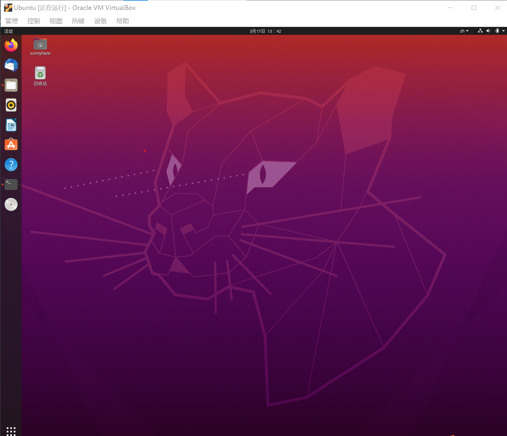
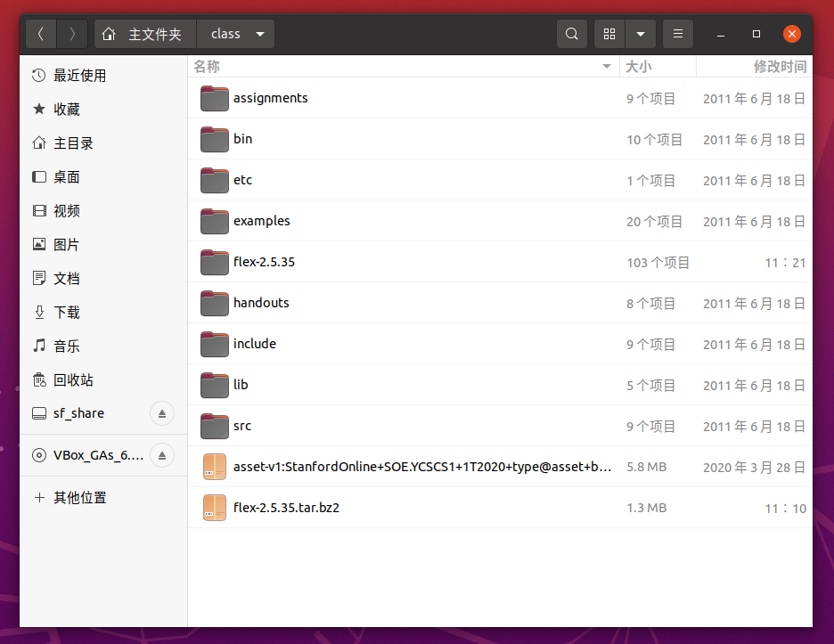
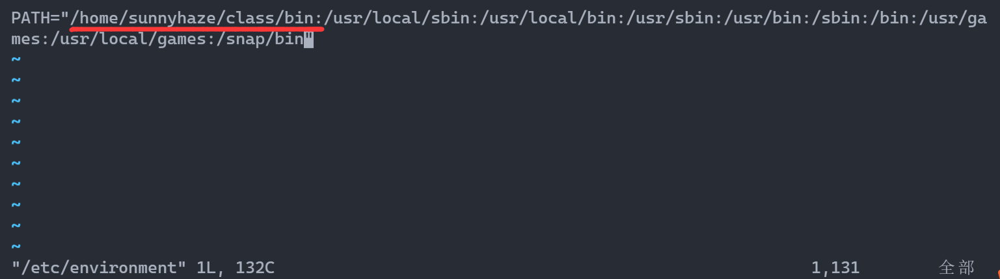

# 斯坦福CS143编译原理
+ 本仓库为Stanfor CS143课程的学习和环境配置教程。

## 主要资源链接
+ [CS143官方主页](http://web.stanford.edu/class/cs143/)
+ [edx.org中的官方课程-包含视频和课件](https://learning.edx.org/course/course-v1:StanfordOnline+SOE.YCSCS1+2T2020/home)

前者主要是本课程相关的PDF资料，比如PPT，书面作业，编程作业要求等等。

后者是另一种形式的在线网课，包含课程视频，提供了代码、配环境指导等等较为连贯的信息。主要内容与线下课相同，但是课程布置顺序，每周的任务布置与实际的斯坦福教学有所出入。作者主要跟随`edx.org`的内容学习。

## 环境配置
课程第一节课结束后就可以考虑配置作业环境了，课程使用了`COOL`语言来教学，全称为`Classroom Object Oriented Language`，是一门专门用于学习如何构建编译器的教学语言。这也导致了它是一门编译器远多于自身语言程序的语言。

第一课结束后要求配置好`COOL`语言环境进行体验，整个运行环境是基于LINUX的。课程提供了一个很早的ubuntu某发行版的虚拟机镜像，但是由于其32位的内核，导致对于目前的Windows用户来说，难以通过VSCODE的REMOTE SSH功能穿透进去（VSCODE不支持此架构）。而纯使用VIM或者VI一类的编辑器对我来说学习成本较高（请尊重个人喜好），所以采用较新的`Ubuntu LTS 20.04`虚拟机环境，并尽可能安装与课程提供的环境相似的**老版本程序**来保证一切的正常运行。

### 构建虚拟机环境
- 从[Virtual Box官网](https://www.virtualbox.org/)下载虚拟机环境并安装。
- 从[Ubuntu Desktop官网](https://ubuntu.com/download/desktop)下载`Ubuntu LTS 20.04`光盘镜像（`*.iso`）文件
- 在`Virtual Box`中新建新环境，并导入Ubuntu的ISO文件，按要求推进安装流程即可。
- 安装成功后进入桌面即可。

    

- 此时建议配置一个**共享文件夹**，便于实现从宿主机与虚拟机的文件传输。
- 作为基本的Linux环境，建议先按如下方式安装`gcc` `g++` `m4` `net-tools` `vim`这些必要包用于编译、配置等等工作。
  ```
  sudo apt-get install xxxxx
  ```
### 按照课程要求配置编译环境

> 本段主要参考[edx.org教程](https://courses.edx.org/courses/course-v1:StanfordOnline+SOE.YCSCS1+2T2020/6b750292e90d4950b895f621a5671b49/)，中间针对环境不同有一些改动，英文好的或者对于Linux较为了解可以忽略此部分

> 同时本文也参考了[知乎anarion的回答](https://zhuanlan.zhihu.com/p/226190284?utm_source=wechat_session)，感谢前人的文章减少了我配环境的时间
- 首先需要将课程配置好的文件打包下载到Ubuntu环境中，建议在`~`路径（`/home/用户名/`）下新建一个`class`文件夹用于本课程文件的存放和书写。
  - 在这个`class`文件夹下，使用`wget`从官网下载数据包，具体语句如下
    ```
    wget https://courses.edx.org/asset-v1:StanfordOnline+SOE.YCSCS1+1T2020+type@asset+block@student-dist.tar.gz
    ```
  - 下载后解压到虚拟机的`~/class`文件夹即可，这时我们可以看到很多解压好的目录结构：(flex相关的文件是后面解压的)
  
    

- 此时我们可以在`bin`文件夹中看到很多可执行文件，这些就是编译好的`cool`语言编译器，MIPS执行环境等等本课程所需的可执行文件。我们需要将它们添加到Ubuntu的环境变量`PATH`中，这样我们就可以在其他路径下随时调用这些指令编译`cool`文件了。
  - 我们先用文本编辑器打开存放全局环境变量的文件，这里使用`vim`
    ```
    sudo vim /etc/environment
    ``` 
    在这里可以看到`PATH`变量目前的内容，我们向其中添加刚才解压的文件夹的`bin`路径，以我的环境为例，我的用户名是`sunnyhaze`，于是我对于`PATH`的修改后的结果如下：
    
    
    
    主要是添加了红线所示的路径，请根据你的具体路径和用户名做出修改即可，注意添加对应的分隔符。

  - 此时还不能正常工作，需要让系统重新读取一遍环境变量执行，这一步通过在终端执行如下指令即可：
      ```
      source /etc/environment
      ```
  - 此时我们对于配置好的环境进行测试，随便在一个路径下输入`coolc`指令查看cool的编译器是否正常运行，如果显示为如下状态，恭喜你，基本配置安装成功。
    ```
    Class Main is not defined.
    Compilation halted due to static semantic errors.
    ```
### 辅助配置MIPS编译环境
- 完成这一步还不可以，如果你尝试用`spim`进一步运行由`coolc`编译的文件，发现可能会报错“找不到文件”，这主要是因为`Ubuntu LTS 20.04`是64位的系统，而此文件由32位编译运行，需要先安装一个32位的适配程序，通过如下方式安装即可：
```
sudo apt-get install lib32z1
```
### 后续课程所需内容预安装
经过上面的流程，基本就完成了`cool`语言编译环境的配置

然而后续的课程还需要安装`flex` 和`bison`这里先提前安装一下：

早期版本的flex和最新的版本有一些更迭，主要是针对语言特性的优化，这也就导致了如果我们直接安装最新的flex可能会导致后面的代码无法运行，所以这里建议下载早期的安装包进行安装，windows下可以直接通过此链接下载

[https://src.fedoraproject.org/lookaside/pkgs/flex/flex-2.5.35.tar.bz2/10714e50cea54dc7a227e3eddcd44d57/flex-2.5.35.tar.bz2](https://src.fedoraproject.org/lookaside/pkgs/flex/flex-2.5.35.tar.bz2/10714e50cea54dc7a227e3eddcd44d57/flex-2.5.35.tar.bz2)

也可以在Ubuntu中使用`wget`下载，下载后请在某文件夹下解压后，在路径下使用`./configure && make && sudo make install`命令安装即可。（如果没安装make，请先安装）


而后的`bison`可以直接通过如下语句安装：
```
sudo apt-get install bison
```